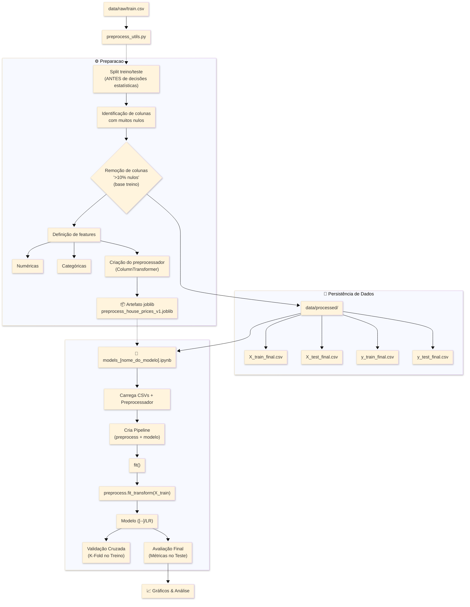

# 🏠 House Prices — Previsão de Imóveis Residenciais

Projeto baseado no desafio **[House Prices – Advanced Regression Techniques (Kaggle)]**.
O objetivo é prever o **preço final de casas em Ames, Iowa**, utilizando técnicas modernas de **Machine Learning para dados tabulares**.


---

## 📌 Objetivo do Projeto

Desenvolver um pipeline completo de **pré-processamento, modelagem e avaliação**, comparando modelos lineares regularizados e métodos ensemble, com foco em:

* Desempenho preditivo
* Controle de overfitting
* Reprodutibilidade

---

## 🔍 O que você vai encontrar neste projeto

* **EDA detalhada** com análise estatística e visual
*  **Pré-processamento robusto** (imputação, normalização, one-hot encoding)
* **Modelos avaliados**:

  * **[Modelos Lineares](https://github.com/albertoakel/Kaggle/blob/master/HousePrices/notebook/models_Linear.ipynb)**
  * **[Random Forest-Ensemble](https://github.com/albertoakel/Kaggle/blob/master/HousePrices/notebook/models_Random_Forest.ipynb)**
  * **[XGBoosting](https://github.com/albertoakel/Kaggle/blob/master/HousePrices/notebook/models_XGBoost.ipynb)**
* **Avaliação comparativa** com MAE, RMSE e R²
*  **Artefatos persistidos** (preprocessador e melhor modelo)

### Principais Highlights do Projeto

* **Pré-processamento padronizado e reutilizável:** utilização do `preprocessador_v0.joblib`, garantindo consistência no tratamento dos dados em todos os experimentos, reprodutibilidade dos resultados e prevenção de *data leakage*.

* **Transformação robusta das variáveis:**

  * variáveis numéricas tratadas com imputação por mediana e padronização;
  * variáveis categóricas convertidas via *One-Hot Encoding*;
  * todo o fluxo encapsulado em um único `ColumnTransformer`, assegurando coerência entre treino, validação e inferência.

* **Pipelines integrados por modelo:** cada algoritmo é treinado dentro de um pipeline único, integrando automaticamente o pré-processamento e a etapa de regressão, reduzindo erros experimentais e facilitando comparações justas.

* **Avaliação sistemática via validação cruzada (K-Fold):** análise do desempenho médio (R²) e da variabilidade entre *folds*, permitindo avaliar não apenas acurácia, mas também **estabilidade e capacidade de generalização**.

* **Comparação entre múltiplas famílias de modelos:**

  * **Modelos Lineares**: Linear Regression, Ridge e Lasso (configurações padrão e ajustadas), usados como baseline interpretável e referência de estabilidade;
  * **Random Forest**: versões padrão e ajustadas, explorando não linearidades e interações entre variáveis;
  * **XGBoost**: três configurações progressivamente regularizadas, focadas em maximizar desempenho e controle de *overfitting*.

* **Avaliação padronizada e reutilizável:** uso das funções auxiliares `metricas_model()` e `valida()` para uniformizar o cálculo de MAE, RMSE e R², simplificando a comparação objetiva entre diferentes estratégias de modelagem.

* **Evolução clara de complexidade e desempenho:** a progressão dos modelos evidencia ganhos consistentes ao sair de abordagens lineares para ensembles baseados em árvores e, finalmente, para *boosting* regularizado, culminando no melhor compromisso entre **erro, estabilidade e generalização** com o XGBoost ajustado

---

## 📊 Resultados dos Modelos

Avaliação realizada sobre o conjunto de teste (target transformado com `log1p`).

| Modelo                   | MAE        | RMSE       | R²         |status|
| ------------------------ | ---------- | ---------- | ---------- |-|
| Linear Regression        | 0.0950     | 0.1826     | 0.8035     |
| Ridge (config 0)         | 0.0945     | 0.1679     | 0.8337     |
| Ridge (config 1)         | 0.0963     | 0.1346     | 0.8932     |🥉
| LASSO (config 0)         | 0.1089     | 0.1508     | 0.8660     |
| LASSO (config 1)         | 0.0994     | 0.1384     | 0.8871     |
| Random Forest (config 0) | 0.0934     | 0.1382     | 0.8874     |
| Random Forest (config 1) | 0.0919     | 0.1383     | 0.8872     |
| XGBoost (config 0)       | 0.0976     | 0.1450     | 0.8760     |
| XGBoost (config 1)       | 0.0894     | 0.1320     | 0.8973     |🥈
| **XGBoost (config 2)**   | **0.0838** | **0.1240** | **0.9093** |🏆

📌 Nota: A pontuação final submetida ao Kaggle foi **0.13202** (14/11/2025).

---

## 📁 Estrutura do Projeto

O projeto segue uma arquitetura modular, separando engenharia de dados, pré-processamento e modelagem. O preprocessamento é encapsulado em um artefato versionado (joblib) e aplicado via pipelines do scikit-learn, garantindo reprodutibilidade, prevenção de data leakage e comparação justa entre modelos.

```
HousePrices/
│
├── app/                     # Aplicações futuras (deploy)
│
├── data/
│   ├── raw/                 # Dados originais
│   └── processed/           # Bases pós-processadas
│
├── image/                   # Imagens e figuras
│
├── notebook/
│   ├── eda_HP.ipynb
│   ├── models_Linear.ipynb
│   ├── models_Random_Forest.ipynb
│   ├── models_XGBoost.ipynb
│   ├── XGB2_submission.ipynb
│   └── setup_notebook.py
│
├── sandbox/                 # Testes, rascunhos e experimentos
│
├── src/
│   ├── preprocess_utils.py
│   ├── model_utils.py
│   ├── functions.py
│   ├── preprocess_house_prices_v1.joblib
│   └── melhor_modelo.h5
│
├── requirements.txt
└── README.md
```
### Fluxograma de operação



---

## 🚀 Como executar o projeto

### 1️⃣ Instalar dependências

```bash
pip install -r requirements.txt
```

### 2️⃣ Executar notebooks

```bash
jupyter notebook
```

### 3️⃣ Pré-processamento automatizado

```bash
python src/preprocess_utils_tic.py
```

